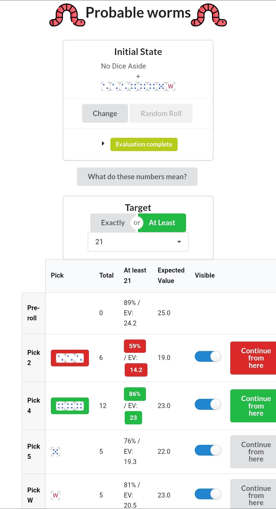

# probable-worms
A dice calculator for the board game [Heckmeck]

Check out the [webpage]

## What's the purpose of this tool?

To help with making the optimal choice of dice drafting. It doesn't completely
solve the game, but it really simplifies the decision-making process.

You still need to decide which tile(s) to go for, but if you have a picked the
target, then this tool will guide you how to get there.

## How to use the tool?

Go to the "What do these numbers mean?" page of the [webpage] to interpret
the statistical data collected, and how to make decisions.

## How do you evaluate a position?

Figuring out how to evaluate a position was quite difficult, as there isn't
a straightforward and simple way to visualise a position's worth. In the end
the approach is relatively simple:

### Four types of evaluation

We evaluate a state in a few different ways, to accommodate different goals:
* Expected value (EV): what's the average result we can achieve?
* Exactly X probability: what's the probability we can stop at exactly X?
* At least X probability: what's the probability we achieve a result at least 
  X?
* EV of at least X: if we treat results under X as failures, what's our EV?

### Two types of "states"

First, we distinguish two "states" of the dice:
* Unrolled state: before rolling the remaining dice
* Rolled state: after rolling the remaining dice, and before choosing an option

### Terminal state evaluation
First, we try to evaluate the terminal states, i.e. the states that have no
further future. These can come from 3 routes:
* We chose to stop at an unrolled state, e.g. because we want to steal
* We have no more unrolled dice, since we drafted all of them
* The options of a rolled state were dice we had already drafted

In that situation the evaluation is quite simple:

Using T as the total we achieved:

|                    | 1    | 2    | ...  | T    |
|--------------------|------|------|------|------|
| **Exactly**        | 0    | 0    | 0    | 100% |
| **At least**       | 100% | 100% | 100% | 100% |
| **EV of at least** | T    | T    | T    | T    |
|                    |
| **EV**             | T    |

This is now the shape of every evaluation we assign to a state

### Non-terminal state evaluation
Now we can recursively evaluate any non-terminal state, by combining in one
way or another the evaluations of the available next-states.

#### Rolled state evaluation

After we've rolled our remaining dice, we have a few distinct next-states,
and since this is a recursive scheme, they have an evaluation of their own.

To combine them to an evaluation of the rolled state, we don't pick a specific
evaluation from the next-states, but calculate each entry in the evaluation
table separately, so we end up with a mix of entries from different next-states.

To construct the evaluation table, we pick the maximum value from each 
next-state evaluation, substituting for 0 if it an evaluation doesn't have a 
specific value.

This reflects the strategy of picking the specific di(c)e that increase our
selected target:

|                    | 1   | ... |
|--------------------|-----|-----|
| **Exactly**        | max | max |
| **At least**       | max | max |
| **EV of at least** | max | max |
|                    |
| **EV**             | max |

#### Unrolled state evaluation

Before rolling the remaining dice we have two options:
* Either stop there
* Or decide to roll the dice, that will have a set of next-states with specific
  probabilities

In the first case the evaluation is known, it's a terminal state.

In the second case, we again calculate each entry independently, reflecting the
fact that each outcome can have a different path based on luck.

To construct the evaluation table, we pick the weighted average form each
next-state evaluation, substituting for 0 if an evaluation doesn't have a
specific value.

Then, we replace the Exactly T entry with 100%, since we can always choose to
stop at T.

|                    | 1   | ... | T    | ... |
|--------------------|-----|-----|------|-----|
| **Exactly**        | avg | avg | 100% | avg |
| **At least**       | avg | avg | avg  | avg |
| **EV of at least** | avg | avg | avg  | avg |
|                    |
| **EV**             | avg |

## Time to evaluate a position

The time needed to evaluate an 8-dice position in the browser, with a 2015
era laptop are a couple of hours, going to about a minute for a 5-dice 
position. Positions with 4 dice or fewer can be calculated in less than a 
second.

We cache 5-dice to 8-dice positions, to have a responsive web app, and 
calculate 4-dice or fewer positions on the fly.

[Heckmeck]: https://boardgamegeek.com/boardgame/15818/pickomino
[webpage]: https://costas-basdekis.github.io/probable-worms
